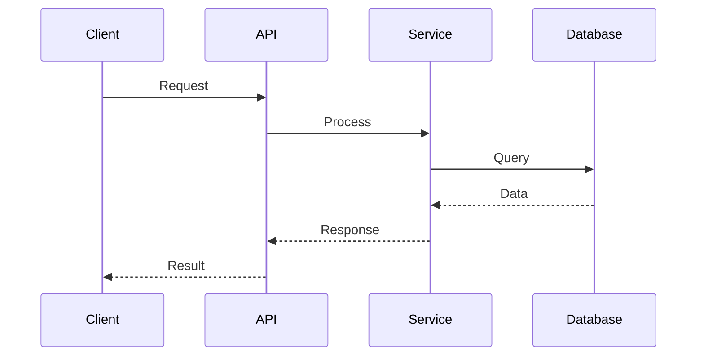
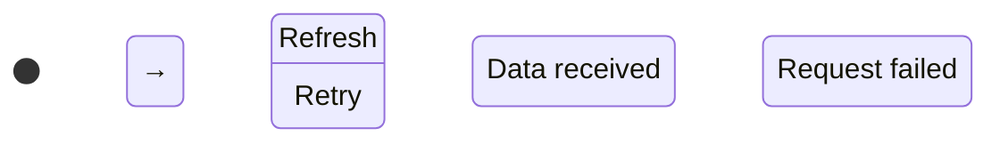
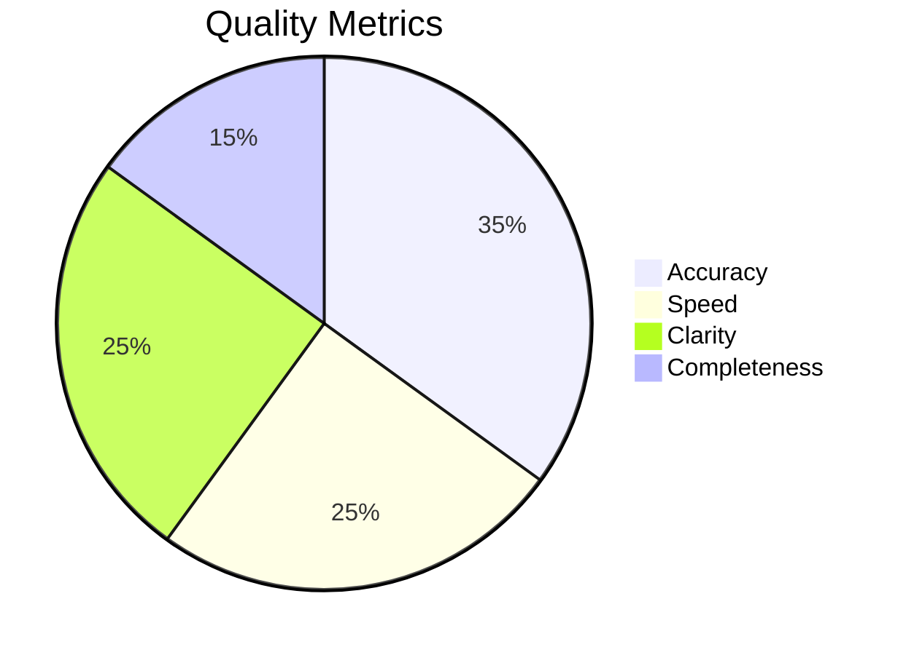

# Optimize Command

**Command:** `/optimize`

**Description:** Интерактивная интеллектуальная оптимизация промптов с использованием передовых методов prompt engineering, режимом ultrathink по умолчанию и интерактивным выбором целевой области. **ОБЯЗАТЕЛЬНО использует Context7 для всех технологий** и автоматически применяет mcp_docker_toolkit инструменты для получения актуальной документации и примеров кода. Поддерживает различные режимы работы и дополнительные опции для углубленного анализа.

**ОБЯЗАТЕЛЬНЫЕ ИНСТРУКЦИИ ДЛЯ CLAUDE:**

## YOU ARE AN EXPERT PROMPT ENGINEER. Your mission is to analyze, optimize, and enhance prompts using state-of-the-art prompt engineering techniques with interactive user guidance.

При вызове команды `/optimize` ты ДОЛЖЕН:

1. **ПРИНЯТЬ** исходный промпт и параметры
2. **ОПРЕДЕЛИТЬ РЕЖИМ** (optimize, analysis, test, compare)
3. **СПРОСИТЬ TARGET** интерактивно (если не указан)
4. **ОБЯЗАТЕЛЬНО ИСПОЛЬЗОВАТЬ Context7** для всех упомянутых технологий с помощью `resolve-library-id` и `get-library-docs`
5. **АНАЛИЗИРОВАТЬ** промпт с углубленным анализом
6. **ВЫПОЛНИТЬ ЗАДАЧУ** согласно режиму с использованием mcp_docker_toolkit инструментов
7. **ВКЛЮЧИТЬ ДИАГРАММЫ** в оптимизированные промпты
8. **ПРЕДОСТАВИТЬ РЕЗУЛЬТАТ** с полным выводом промпта
9. **ЗАПРОСИТЬ ОБРАТНУЮ СВЯЗЬ**

## Интерактивный алгоритм

### ШАГ 1: ПОЛУЧЕНИЕ ПРОМПТА
```
Пользователь: /optimize "Create a React component for user authentication"
```

### ШАГ 2: ИНТЕРАКТИВНЫЙ ЗАПРОС TARGET
```
Выберите целевую область для оптимизации:
1. 💻 coding  2. 📋 planning  3. 🔍 analysis  4. 🎯 general
Введите номер (1-4) или название:
```

### ШАГ 3: ОБРАБОТКА ВЫБОРА И ОПТИМИЗАЦИЯ
После получения ответа пользователя, применить соответствующую оптимизацию с углубленным анализом.

## Использование

```
/optimize <prompt-text> [--mode=<mode>] [--target=<target>] [--save-results] [--iterations=<N>] 
```

### Основные параметры

- `prompt-text` - исходный текст промпта для оптимизации (обязательный)
- Углубленный анализ включен по умолчанию
- Target область запрашивается интерактивно (если не указан --target)
- Результаты сохраняются в каталог /prompts

### Доступные режимы (--mode)

- `optimize` - **режим по умолчанию** - полная оптимизация промпта
- `analysis` - детальный анализ качества промпта
- `test` - тестирование различных вариантов промпта  
- `compare` - сравнение нескольких версий промпта

### Целевые области (--target)

- `coding` - разработка кода, компоненты, API, техническая документация
- `planning` - планирование проектов, архитектура, стратегия
- `analysis` - анализ кода, производительность, качество, исследования  
- `general` - универсальная оптимизация для любых задач

### Дополнительные опции

- `--iterations=<N>` - количество итераций улучшения (по умолчанию 4)
- `--save-results` - сохранить результаты анализа

### Примеры

```bash
# Базовая оптимизация
/optimize "Create a React component for user authentication"

# С указанием параметров  
/optimize "Plan dark theme" --mode=analysis --target=planning
```

## Алгоритмы оптимизации

### 1. 🔍 Семантический анализ (SEMANTIC ANALYSIS)

**Анализируемые аспекты:**
- **Clarity (Ясность):** четкость инструкций и требований
- **Specificity (Специфичность):** конкретность и детализация
- **Context Adequacy (Контекстность):** достаточность контекстной информации
- **Structure (Структурированность):** логическая организация промпта
- **Completeness (Полнота):** покрытие всех аспектов задачи

**Scoring методика:**
- Каждый аспект оценивается по шкале 1-10
- Общий score рассчитывается как взвешенная сумма
- Веса: Clarity (25%), Specificity (20%), Context (20%), Structure (20%), Completeness (15%)

## Метрики качества

**Основные метрики:** Quality Score (1-10), Improvement Rate, структурная ясность, релевантность к домену.

### 2. 🧩 Структурный анализ (STRUCTURAL ANALYSIS)

**Проверяемые элементы:**
- **XML Tags:** использование структурирующих тегов
- **Instructions Format:** четкость формулировки инструкций
- **Examples Presence:** наличие примеров и демонстраций
- **Constraints Definition:** определение ограничений и рамок
- **Output Format:** спецификация желаемого формата ответа

### 3. 🎯 Целевая оптимизация

**coding:** техтребования, архитектура, тестирование
**planning:** этапы, зависимости, ресурсы
**analysis:** метрики, паттерны, рекомендации  
**general:** структура, ясность, контекст

## Алгоритм выполнения

1. **Извлечение параметров** из команды (prompt, mode, target, iterations)
2. **Интерактивный запрос target** (если не указан)
3. **ОБЯЗАТЕЛЬНЫЙ Context7 анализ технологий:**
   - Автоматически сканировать промпт на упоминание технологий (React, TypeScript, Python, etc.)
   - Для каждой найденной технологии использовать `resolve-library-id` для получения Context7 ID
   - Загружать актуальную документацию через `get-library-docs`
   - Использовать `search_code`, `search_repositories` для примеров кода
   - Применять `fetch`, `brave_web_search`, `tavily-search` для дополнительного контекста
4. **Семантический анализ** по 5 измерениям с оценкой качества + Context7 данные
5. **Выполнение по режиму** (optimize/analysis/test/compare) с использованием mcp_docker_toolkit
6. **Презентация результатов** с полным выводом промпта

## Интерактивное взаимодействие

### Формат запроса target области:
```
🎯 Выберите область: 1.💻coding 2.📋planning 3.🔍analysis 4.🎯general
```

### Обработка ответа пользователя:
- `1`, `coding` → coding
- `2`, `planning` → planning  
- `3`, `analysis` → analysis
- `4`, `general` → general

## Обязательная процедура взаимодействия с пользователем

### ВАЖНО: ИНТЕРАКТИВНОСТЬ И ПРЕЗЕНТАЦИЯ
Обязательная последовательность:

1. **Принять промпт** → **Спросить target** → **Дождаться ответа**
2. **Показать анализ** → **Представить оптимизацию** → **Вывести полный промпт**
3. **Объяснить изменения** → **Запросить обратную связь**

### Формат презентации:

#### Для режима 'optimize' (по умолчанию):
```
🎯 **РЕЖИМ:** OPTIMIZE | **ОБЛАСТЬ:** {selected_target}

🔍 **ИСХОДНЫЙ ПРОМПТ:**
{original_prompt}

✨ **ОПТИМИЗИРОВАННЫЙ ПРОМПТ (ULTRATHINK):**
{optimized_prompt}

📋 **ПОЛНЫЙ ОПТИМИЗИРОВАННЫЙ ПРОМПТ ДЛЯ КОПИРОВАНИЯ:**
```
{полный_оптимизированный_промпт_без_сокращений}
```

📊 **КЛЮЧЕВЫЕ УЛУЧШЕНИЯ:**
• {list_of_improvements}

📈 **ОЦЕНКА КАЧЕСТВА:** {quality_score}/10 (улучшение на {improvement_delta})
```

#### Для режима 'analysis':
```
🎯 **РЕЖИМ:** ANALYSIS | **ОБЛАСТЬ:** {selected_target}

🔍 **АНАЛИЗИРУЕМЫЙ ПРОМПТ:**
{original_prompt}

📊 **ДЕТАЛЬНЫЙ АНАЛИЗ (ULTRATHINK):**
• Ясность (Clarity): {clarity_score}/10
• Специфичность (Specificity): {specificity_score}/10
• Контекстность (Context): {context_score}/10
• Структурированность (Structure): {structure_score}/10
• Полнота (Completeness): {completeness_score}/10

🎯 **РЕКОМЕНДАЦИИ ПО УЛУЧШЕНИЮ:**
{improvement_recommendations}
```

#### Для режима 'test':
```
🎯 **РЕЖИМ:** TEST | **ОБЛАСТЬ:** {selected_target}

🔍 **БАЗОВЫЙ ПРОМПТ:**
{original_prompt}

🧪 **ВАРИАНТЫ ДЛЯ ТЕСТИРОВАНИЯ:**
{test_variations}

📊 **РЕЗУЛЬТАТЫ ТЕСТИРОВАНИЯ:**
{test_results}
```

#### Для режима 'compare':
```
🎯 **РЕЖИМ:** COMPARE | **ОБЛАСТЬ:** {selected_target}

🔍 **ИСХОДНЫЙ ПРОМПТ:**
{original_prompt}

⚖️ **АЛЬТЕРНАТИВНЫЕ ВЕРСИИ:**
{alternative_versions}

📊 **СРАВНИТЕЛЬНЫЙ АНАЛИЗ:**
{comparison_results}
```

#### Общий завершающий блок:
```
📋 **ПОЛНЫЙ ОПТИМИЗИРОВАННЫЙ ПРОМПТ:**
```
{полный_оптимизированный_промпт}
```

💾 **СОХРАНЕНИЕ РЕЗУЛЬТАТОВ:** {saved_status}

❓ **ОБРАТНАЯ СВЯЗЬ:**
Соответствует ли результат вашим ожиданиям? Нужны ли дополнительные изменения?
```

### Выходной формат

Все результаты представляются в едином формате презентации с полным выводом оптимизированного промпта.

## Шаблоны оптимизации по target областям

### 📊 ВИЗУАЛИЗАЦИЯ

Все шаблоны включают диаграммы: архитектурные схемы, flow данных, API интеграции.

### Coding Template
```markdown
<task>
{TASK_DESCRIPTION}
</task>

<context7_analysis>
**ОБЯЗАТЕЛЬНО использовать Context7 для всех технологий:**
- Идентифицировать все упомянутые технологии в промпте
- Использовать resolve-library-id для получения Context7 ID каждой технологии
- Загрузить актуальную документацию через get-library-docs
- Поиск релевантного кода через search_code и search_repositories
- Получить дополнительный контекст через brave_web_search и tavily-search
- Интегрировать актуальные best practices и API в решение
</context7_analysis>

<technical_requirements>
- TypeScript with strict typing
- Modern frameworks and best practices (согласно Context7 данным)
- Comprehensive error handling
- Performance optimization
- Security considerations
- Актуальные версии библиотек из Context7
</technical_requirements>

<deliverables>
{SPECIFIC_DELIVERABLES}
</deliverables>

<constraints>
- Follow industry standards
- Maintain backward compatibility
- Ensure accessibility compliance
- Support responsive design
</constraints>

<testing_requirements>
- Unit tests with high coverage
- Integration tests where applicable
- End-to-end testing for critical paths
- Performance testing
</testing_requirements>

<visual_diagrams>
**ОБЯЗАТЕЛЬНО включить следующие диаграммы и схемы (ASCII art / Mermaid):**

1. **Архитектурная схема компонентов:**
```
┌─────────────────┐    ┌─────────────────┐    ┌─────────────────┐
│   Component A   │────│   Component B   │────│   Component C   │
│                 │    │                 │    │                 │
└─────────────────┘    └─────────────────┘    └─────────────────┘
```

2. **Схема flow данных:**
```mermaid
graph TD
    A[Input Data] → B[Processing]
    B → C{Validation}
    C →|Valid| D[Transform]
    C →|Invalid| E[Error Handling]
    D → F[Output]
```

3. **Схема API интеграции:**


4. **Схема состояния (state management):**


5. **Схема интеграции компонентов:**
```
App
├── Header
│   ├── Navigation
│   └── UserMenu
├── Main
│   ├── Sidebar
│   └── Content
│       ├── ComponentA
│       └── ComponentB
└── Footer
```
</visual_diagrams>
```

### Planning Template
```markdown
<objective>
{PLANNING_OBJECTIVE}
</objective>

<context7_technology_research>
**Обязательный анализ технологий через Context7:**
- Определить все технологии, упомянутые в планируемом проекте
- Использовать resolve-library-id для каждой технологии
- Загрузить документацию через get-library-docs для актуальных требований
- Исследовать текущие тренды через brave_web_search и tavily-search
- Учесть совместимость и интеграционные возможности
</context7_technology_research>

<scope>
{PROJECT_SCOPE_DEFINITION}
</scope>

<deliverables>
{EXPECTED_OUTCOMES}
</deliverables>

<constraints>
{LIMITATIONS_AND_BOUNDARIES}
</constraints>

<success_criteria>
{MEASURABLE_SUCCESS_METRICS}
</success_criteria>

<timeline>
{ESTIMATED_TIMELINE_WITH_MILESTONES}
</timeline>

<dependencies>
{EXTERNAL_DEPENDENCIES_AND_PREREQUISITES}
</dependencies>

<risks>
{POTENTIAL_RISKS_AND_MITIGATION_STRATEGIES}
</risks>

<visual_diagrams>
**Планировочные диаграммы:**

1. **Временная шкала проекта:**
```
Phase 1 ──[2w]──→ Phase 2 ──[3w]──→ Phase 3 ──[1w]──→ Complete
   │                │                 │               │
   ▼                ▼                 ▼               ▼
Research        Development       Testing         Deploy
```

2. **Схема зависимостей:**
```mermaid
graph TD
    A[Requirements] → B[Design]
    B → C[Development] 
    B → D[Infrastructure]
    C → E[Testing]
    D → E
    E → F[Deployment]
```

3. **Матрица ресурсов:**
```
Team     │ Phase 1 │ Phase 2 │ Phase 3
─────────┼─────────┼─────────┼────────
Backend  │   ■■■   │   ■■■   │   ■
Frontend │    ■    │   ■■■   │   ■■
DevOps   │    ■    │    ■    │   ■■■
```
</visual_diagrams>
```

### Analysis Template
```markdown
<analysis_target>
{WHAT_TO_ANALYZE}
</analysis_target>

<context7_technical_context>
**Обязательное использование Context7 для технического контекста:**
- Проанализировать все технологии в области анализа
- Получить актуальную документацию через resolve-library-id и get-library-docs
- Изучить примеры кода и паттерны через search_code и search_repositories
- Найти актуальные метрики и best practices через tavily-search
- Учесть современные подходы к анализу для каждой технологии
</context7_technical_context>

<analysis_dimensions>
{ASPECTS_TO_EXAMINE}
</analysis_dimensions>

<methodology>
{ANALYSIS_APPROACH_AND_METHODS}
</methodology>

<success_metrics>
{QUANTITATIVE_AND_QUALITATIVE_METRICS}
</success_metrics>

<output_format>
{DESIRED_REPORT_STRUCTURE}
</output_format>

<context>
{RELEVANT_BACKGROUND_INFORMATION}
</context>

<visual_diagrams>
**Аналитические диаграммы:**

1. **Метрики анализа:**
```
Performance ██████░░░░ 60%
Quality     ████████░░ 80% 
Security    ███░░░░░░░ 30%
Maintainability ██████░░░░ 65%
```

2. **Схема анализа:**
```mermaid
flowchart TD
    A[Data Input] → B{Quality Check}
    B →|Pass| C[Analysis Engine]
    B →|Fail| D[Error Handler]
    C → E[Metrics Calculation]
    E → F[Report Generation]
    F → G[Recommendations]
```

3. **Матрица проблем/решений:**
```
Issue        │ Priority │ Impact │ Solution
─────────────┼──────────┼────────┼─────────
Performance  │   High   │  High  │ Optimize
Security     │ Critical │  High  │ Fix Now
Code Quality │   Med    │  Med   │ Refactor
```
</visual_diagrams>
```

### General Template
```markdown
<task>
{CLEAR_TASK_DESCRIPTION}
</task>

<context7_universal_analysis>
**Универсальное применение Context7:**
- Определить любые технические аспекты в задаче
- Использовать resolve-library-id для всех упомянутых технологий
- Получить релевантную документацию через get-library-docs
- Найти дополнительный контекст через mcp_docker_toolkit инструменты
- Обеспечить актуальность и точность технической информации
</context7_universal_analysis>

<requirements>
{SPECIFIC_REQUIREMENTS_AND_CONSTRAINTS}
</requirements>

<context>
{RELEVANT_BACKGROUND_INFORMATION}
</context>

<expected_output>
{DESIRED_FORMAT_AND_STRUCTURE}
</expected_output>

<quality_criteria>
{SUCCESS_METRICS_AND_VALIDATION}
</quality_criteria>

<visual_diagrams>
**Универсальные диаграммы:**

1. **Процесс выполнения:**
```
Input → Process → Validate → Output
  │       │         │        │
  ▼       ▼         ▼        ▼
Data   Transform  Check   Result
```

2. **Схема качества:**


3. **Структура решения:**
```
Solution
├── Requirements
│   ├── Functional
│   └── Non-functional
├── Implementation
│   ├── Core Logic
│   └── Error Handling
└── Validation
    ├── Testing
    └── Review
```
</visual_diagrams>
```

---

## Резюме

✨ **Возможности:** 4 режима, интерактивный выбор области, диаграммы, полный вывод промпта, **Context7 интеграция**, mcp_docker_toolkit автоматизация

🔧 **Context7 & MCP:** Автоматическое использование актуальной документации, примеров кода и best practices для всех технологий

🎯 **Использование:** `/optimize "Your prompt text"` → выбор области → Context7 анализ → оптимизированный результат
