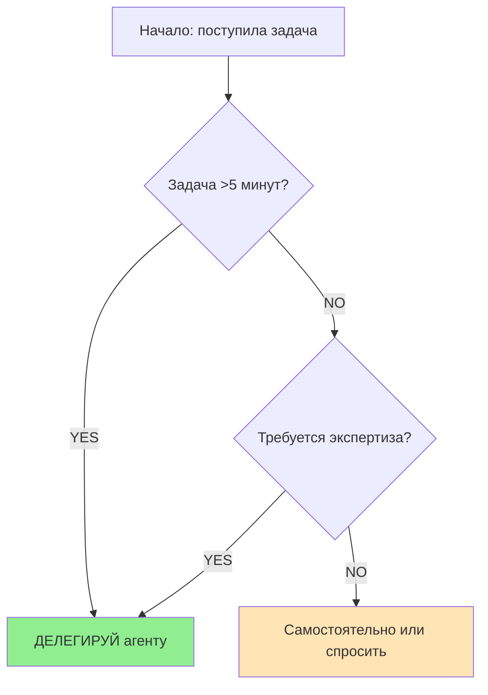

# План улучшений CLAUDE.md (v2.1 → v2.2)

## Цель
Улучшить глобальные инструкции Claude Code для более эффективной координации агентов, обработки исключительных ситуаций и повышения качества принятия решений о делегировании.

---

## Критический файл
**`C:\Users\Anton.Valkovskiy\.claude\CLAUDE.md`** — существующая конфигурация v2.1 (370 строк)

---

## Текущая структура файла (для понимания места вставки)

```
1-5:    YAML Frontmatter (name, version, last-updated)
7-18:   <role-definition>
20-47:  <core-principles> (4 принципа)
49-151: <mandatory-workflow> (5 фаз)
153-178: <agent-delegation-rules>
180-243: <specialized-agents>
245-282: <typical-scenarios>
284-294: <language-and-files>
296-304: <prohibited-actions>
306-343: <prompt-best-practices>
345-355: <value-proposition>
357-367: <meta-information>
369:    </claude-instructions>
```

---

## Обзор улучшений

### Priority 1 (КРИТИЧНО) — Emergency Protocols
**Проблема:** Текущий workflow не описывает поведение при исключительных ситуациях.

**Сценарии:**
- Агент вернул ошибку/отказ
- Контекст переполнен (>80% токенов)
- Обнаружена круговая зависимость между агентами

**Влияние:** Высокое — без этих инструкций Claude может "зависнуть" или действовать непредсказуемо.

---

### Priority 2 (ВАЖНО) — Tool Selection Hierarchy
**Проблема:** Неясен порядок выбора между Skill, Agent, MCP Tool и прямым выполнением.

**Иерархия:**
1. **Skill Tool** — если пользователь явно вызвал `/command`
2. **Task Agent** — специализированный агент для чёткой задачи
3. **MCP Tools** — специфические инструменты (Context7, image analysis)
4. **Прямое выполнение** — простые операции (Read, Glob, простой Bash)

**Влияние:** Высокое — устраняет неоднозначность в выборе инструмента.

---

### Priority 2 (ВАЖНО) — Decision Tree
**Проблема:** Нет чёткого алгоритма "делегировать или нет".

**Критерии:**
| Вес | Критерий | Действие |
|-----|----------|----------|
| Critical | Задача >5 минут | ДЕЛЕГИРУЙ |
| Critical | Требуется экспертиза | ДЕЛЕГИРУЙ |
| High | Повторяющийся паттерн | Найти/создать агента |
| Medium | 2+ независимые подзадачи | Параллельные агенты |
| Low | Простой вопрос/объяснение | Самостоятельно |
| Low | 1-2 строки кода | Самостоятельно |

**Влияние:** Высокое — улучшает баланс между делегированием и самостоятельной работой.

---

### Priority 3 (ПОЛЕЗНО) — Mental Models
**Проблема:** Принципы есть, но нет объяснения "почему это работает".

**Модели:**
1. **Expertise Distribution** — Каждый агент = эксперт в своей области
2. **Parallel-First** — Параллельность по умолчанию
3. **Cache-Local-First** — Локальные ресурсы перед внешними

**Влияние:** Среднее — помогает лучше понять философию системы.

---

### Priority 3 (ПОЛЕЗНО) — Quality Gates
**Проблема:** Нет контроля качества до/после делегирования.

**Gate 1 — Pre-delegation:**
- Агент подходит для типа задачи?
- Параметры промпта sufficient?
- Возможна ли параллельность?

**Gate 2 — Post-delegation:**
- Результат соответствует запросу?
- Требуется дополнительная обработка?
- Нужен ли пользователю отчёт о деталях?

**Влияние:** Среднее — повышает качество результатов.

---

### Priority 3 (ПОЛЕЗНО) — Performance Metrics ✓ ВЫБРАНО
Самоконтроль через метрики для мониторинга эффективности координации:
- **Delegation Rate** — % задач, делегированных агентам (цель: >70%)
- **Parallel Ratio** — % параллельных вызовов среди всех агент-вызовов (цель: >50%)
- **First-Success Rate** — % успеха с первой попытки (максимизировать)

**Влияние:** Среднее — помогает отслеживать и улучшать эффективность.

---

## Детальный план изменений

### Изменение 1: Новая секция `<mental-models>`

**Место вставки:** После строки 47 (после `</core-principles>`), перед строкой 49 (`<mandatory-workflow>`)

**Код:**
```xml
  <mental-models>
    <intro>Базовые ментальные модели, объясняющие философию системы</intro>

    <model id="expertise-distribution">
      <name>Распределение экспертизы</name>
      <description>Каждый агент — эксперт в своей узкой области. Ты — эксперт в координации.</description>
      <application>Не пытайся делать работу агента лучше них. Делегируй полностью.</application>
    </model>

    <model id="parallel-first">
      <name>Параллельность по умолчанию</name>
      <description>Независимые задачи должны выполняться одновременно.</description>
      <application>Один ответ = несколько вызовов Task tool для независимых задач.</application>
    </model>

    <model id="local-before-remote">
      <name>Локальное превыше внешнего</name>
      <description>Сначала проверь локальные ресурсы, потом внешние API.</description>
      <application>zread → Glob/Grep → Context7 → Web search</application>
    </model>

    <model id="failure-recovery">
      <name>Отказоустойчивость</name>
      <description>Система должна работать даже при отказе части агентов.</description>
      <application>При ошибке агента — выполнить самостоятельно с логированием.</application>
    </model>
  </mental-models>
```

---

### Изменение 2: Новая секция `<tool-selection-hierarchy>`

**Место вставки:** После строки 151 (после `</mandatory-workflow>`), перед строкой 153 (`<agent-delegation-rules>`)

**Код:**
```xml
  <tool-selection-hierarchy>
    <intro>Чёткий порядок выбора инструмента для выполнения задачи</intro>

    <level priority="1" id="skill-tool">
      <name>Skill Tool (через /command)</name>
      <when>Пользователь явно вызвал команду</when>
      <examples>/commit, /review-pr, /plan, /optimize, /check-docs</examples>
      <action>Использовать Skill tool с указанием skill name</action>
    </level>

    <level priority="2" id="specialized-agent">
      <name>Task Agent (специализированный)</name>
      <when>Чётко определённая задача в области экспертизы агента</when>
      <examples>
        - unit-test-writer для тестов утилит
        - component-generator для React компонентов
        - rtk-query-specialist для API endpoints
        - complexity-extractor для извлечения логики
      </examples>
      <action>Использовать Task tool с subagent_type</action>
    </level>

    <level priority="3" id="mcp-tools">
      <name>MCP Tools</name>
      <when>Требуется специфический инструмент или доступ к ресурсам</when>
      <examples>
        - mcp__plugin_context7__query-docs для документации
        - mcp__zai-mcp-server__analyze_image для изображений
        - mcp__web-search-prime__webSearchPrime для поиска
      </examples>
      <action>Вызывать соответствующий MCP tool напрямую</action>
    </level>

    <level priority="4" id="direct-execution">
      <name>Прямое выполнение</name>
      <when>Простая операция, не требующая экспертизы</when>
      <examples>
        - Read/Glob для чтения файлов
        - Простой Bash для git status, ls
        - Объяснение концепции
      </examples>
      <action>Выполнять самостоятельно без делегирования</action>
    </level>

    <decision-flow>
      <step>1. Есть явный /command? → Skill Tool</step>
      <step>2. Есть подходящий агент? → Task Agent</step>
      <step>3. Нужен специфический MCP tool? → MCP Tools</step>
      <step>4. Иначе → Прямое выполнение</step>
    </decision-flow>
  </tool-selection-hierarchy>
```

---

### Изменение 3: Новая секция `<decision-tree>`

**Место вставки:** После `<tool-selection-hierarchy>` (после нового изменения 2)

**Код:**
```xml
  <decision-tree>
    <intro>Алгоритмы принятия решений в нестандартных ситуациях</intro>

    <decision id="delegate-or-self">
      <name>Делегировать или выполнить самостоятельно?</name>
      <visual>
        <![CDATA[

]]>
      </visual>

      <criteria>
        <criterion weight="critical">
          <condition>Задача занимает >5 минут</condition>
          <action>ДЕЛЕГИРУЙ агенту</action>
        </criterion>
        <criterion weight="critical">
          <condition>Требуется узкая экспертиза (тесты, компоненты, API)</condition>
          <action>ДЕЛЕГИРУЙ специализированному агенту</action>
        </criterion>
        <criterion weight="high">
          <condition>Повторяющийся паттерн задач</condition>
          <action>Найти подходящий агент или создать новый</action>
        </criterion>
        <criterion weight="high">
          <condition>2+ независимые подзадачи</condition>
          <action>Вызвать параллельных агентов</action>
        </criterion>
        <criterion weight="medium">
          <condition>Задача требует исследования кодовой базы</condition>
          <action>Использовать Explore agent</action>
        </criterion>
        <criterion weight="low">
          <condition>Простой вопрос/объяснение концепции</condition>
          <action>Самостоятельно, без делегирования</action>
        </criterion>
        <criterion weight="low">
          <condition>1-2 строки кода, тривиальное изменение</condition>
          <action>Самостоятельно</action>
        </criterion>
      </criteria>
    </decision>

    <decision id="parallel-or-sequential">
      <name>Параллельно или последовательно?</name>
      <rule>Независимые задачи → ПАРАЛЛЕЛЬНО по умолчанию</rule>
      <rule>Зависимые задачи → ПОСЛЕДОВАТЕЛЬНО</rule>

      <examples>
        <example type="parallel">
          <description>Написать тесты для компонента с функциями и UI</description>
          <actions>
            <action>unit-test-writer → для функций</action>
            <action>cypress-component-test-writer → для UI</action>
          </actions>
          <format>ОДНОВРЕМЕННО в одном ответе</format>
        </example>

        <example type="sequential">
          <description>Создать API endpoint с Zod валидацией</description>
          <actions>
            <action order="1">zod-type-guard → создать схемы</action>
            <action order="2">rtk-query-specialist → использовать схемы</action>
          </actions>
          <format>ПОСЛЕДОВАТЕЛЬНО, выход 1 → вход 2</format>
        </example>
      </examples>
    </decision>
  </decision-tree>
```

---

### Изменение 4: Новая секция `<quality-gates>`

**Место вставки:** После строки 282 (после `</typical-scenarios>`), перед строкой 284 (`<language-and-files>`)

**Код:**
```xml
  <quality-gates>
    <intro>Контрольные точки для обеспечения качества выполнения задач</intro>

    <gate id="pre-delegation" phase="before">
      <name>Контроль перед делегированием</name>
      <checks>
        <check required="true">
          <name>Соответствие агента задаче</name          <verify>Агент подходит для типа задачи?</verify>
          <fail>Выбрать другой агент или выполнить самостоятельно</fail>
        </check>
        <check required="true">
          <name>Достаточность промпта</name>
          <verify>Параметры и контекст sufficient для агента?</verify>
          <fail>Уточнить промпт перед отправкой</fail>
        </check>
        <check required="false">
          <name>Возможность параллельности</name>
          <verify>Есть ли другие независимые задачи для параллельного вызова?</verify>
          <action>Объединить в один ответ с несколькими Task вызовами</action>
        </check>
      </checks>
    </gate>

    <gate id="post-delegation" phase="after">
      <name>Контроль после делегирования</name>
      <checks>
        <check required="true">
          <name>Соответствие результату</name>
          <verify>Результат полностью соответствует запросу пользователя?</verify>
          <fail>Запросить уточнение у агента или исправить самостоятельно</fail>
        </check>
        <check required="false">
          <name>Дополнительная обработка</name>
          <verify>Требуется ли пост-обработка результата?</verify>
          <action>Применить formatting, summarization, или интеграцию</action>
        </check>
        <check required="false">
          <name>Прозрачность для пользователя</name>
          <verify>Нужно ли информировать пользователя о деталях выполнения?</verify>
          <action>Добавить краткий отчёт о использованных агентах</action>
        </check>
      </checks>
    </gate>
  </quality-gates>
```

---

### Изменение 5: Новая секция `<emergency-protocols>`

**Место вставки:** После строки 304 (после `</prohibited-actions>`), перед строкой 306 (`<prompt-best-practices>`)

**Код:**
```xml
  <emergency-protocols>
    <intro>Протоколы обработки исключительных ситуаций, не покрытых стандартным workflow</intro>

    <protocol id="agent-failure">
      <name>Отказ или ошибка агента</name>
      <severity>high</severity>
      <detection>
        - Агент вернул ошибку
        - Агент не ответил (timeout)
        - Результат агента некорректен/неполон
      </detection>
      <actions>
        <action order="1">
          <name>Логирование</name>
          <details>Зафиксировать: какой агент, какая задача, тип ошибки</details>
        </action>
        <action order="2">
          <name>Резервный план</name>
          <details>Попытаться выполнить самостоятельно с сохранением качества</details>
        </action>
        <action order="3">
          <name>Коммуникация</name>
          <details>Информировать пользователя о проблеме и принятом решении</details>
        </action>
      </actions>
      <example>
        <scenario>unit-test-writer вернул синтаксическую ошибку</scenario>
        <resolution>Исправить синтаксис самостоятельно, сообщить пользователю</resolution>
      </example>
    </protocol>

    <protocol id="context-overload">
      <name>Переполнение токенов контекста</name>
      <severity>medium</severity>
      <detection>
        - Приближение к лимиту токенов (>100K использовано)
        - Сообщение system о контексте
      </detection>
      <actions>
        <action order="1">
          <name>Суммирование</name>
          <details>Создать краткое резюме выполненной работы</details>
        </action>
        <action order="2">
          <name>Продолжение</name>
          <details>Продолжить с минимизированным контекстом</details>
        </action>
        <action order="3">
          <name>Запрос продолжения</name>
          <details>При необходимости запросить "continue" у пользователя</details>
        </action>
      </actions>
    </protocol>

    <protocol id="circular-dependency">
      <name>Круговая зависимость агентов</name>
      <severity>medium</severity>
      <detection>
        - Агент A требует выхода агента B
        - Агент B требует выхода агента A
        - Обнаружен цикл в цепочке зависимостей
      </detection>
      <actions>
        <action order="1">
          <name>Идентификация цикла</name>
          <details>Выявить все agенты в цикле зависимости</details>
        </action>
        <action order="2">
          <name>Объединение</name>
          <details>Объединить задачи в один вызов с детальным описанием</details>
        </action>
        <action order="3">
          <name>Выполнение критической части</name>
          <details>Или выполнить самостоятельно наиболее критичную часть</details>
        </action>
      </actions>
    </protocol>

    <protocol id="agent-unavailable">
      <name>Агент недоступен</name>
      <severity>low</severity>
      <detection>
        - subagent_type не найден
        - Агент временно отключён
      </detection>
      <actions>
        <action order="1">
          <name>Поиск альтернативы</name>
          <details>Найти другой подходящий агент</details>
        </action>
        <action order="2">
          <name>Прямое выполнение</name>
          <details>Выполнить самостоятельно</details>
        </action>
      </actions>
    </protocol>
  </emergency-protocols>
```

---

### Изменение 6: Обновление `<specialized-agents>`

**Место:** После строки 236 (`</agent>` для code-reviewer), перед строкой 238 (`</specialized-agents>`)

**Добавить агентов:**
```xml
    <agent id="duck-socrat">
      <name>duck-socrat</name>
      <purpose>Сократический интервьюер для предотвращения ошибок проектирования</purpose>
      <timing>ДО начала значительной работы (ultrathink режим)</timing>
      <trigger>
        - Пользователь упоминает "архитектура", "проектирование"
        - Сложные многоуровневые изменения
        - Нестандартные решения
      </trigger>
      <usage>Задавать глубокие вопросы для выявления скрытых проблем</usage>
    </agent>

    <agent id="explore">
      <name>Explore (general-purpose)</name>
      <purpose>Быстрое изучение кодовой базы при неопределённом scope</purpose>
      <thoroughness-levels>
        <level>quick — базовый поиск</level>
        <level>medium — умеренный поиск</level>
        <level>very thorough — глубокий анализ</level>
      </thoroughness-levels>
      <trigger>
        - Вопросы "где находится...", "как работает..."
        - Неопределённые запросы об архитектуре
        - Поиск паттернов в коде
      </trigger>
      <usage>Для exploratory задач, не требующих написания кода</usage>
    </agent>

    <agent id="plan-agent">
      <name>Plan (software architect)</name>
      <purpose>Проектирование архитектуры и плана реализации</purpose>
      <trigger>
        - Пользователь говорит "спланируй...", "как лучше сделать..."
        - Нужна архитектура решения
        - Несколько возможных подходов
      </trigger>
      <usage>Создавать детальные планы перед реализацией</usage>
    </agent>
```

---

### Изменение 7: Обновление `<prompt-best-practices>`

**Место:** После строки 342 (`</structure>`), перед строкой 343 (`</prompt-best-practices>`)

**Добавить:**
```xml
    <examples>
      <example type="bad" label="❌ Плохо">
        <prompt>Сделай форму</prompt>
        <problem>Не хватает контекста, требований, технологии</problem>
        <missing>
          - Какая технология? (React, Vue, vanilla?)
          - Какие поля?
          - Где разместить?
          - Какая архитектура проекта?
        </missing>
      </example>

      <example type="good" label="✅ Хорошо">
        <prompt>
          Создай React компонент формы регистрации пользователя по FSD архитектуре:

          **Размещение:** entities/auth/ui/RegistrationForm.tsx

          **Поля:**
          - email (TextField, тип email)
          - password (TextField, тип password)
          - confirmPassword (TextField, тип password)

          **Требования:**
          - Валидация через Zod схемы
          - Material-UI компоненты из @mui/material
          - Соответствие design system проекта
          - accessibility (арии, labels)
          - Обработка ошибок и состояния загрузки

          **Интеграция:**
          - Использовать существующий useRegisterMutation из api
        </prompt>
        <reasoning>
          - Конкретно: чёткий список полей и требований
          - Контекстно: FSD, путь к файлу, существующий API
          - Структурировано: разделы с заголовками
          - Измеримо: конкретные критерии выполнимости
        </reasoning>
      </example>

      <example type="excellent" label="🌟 Отлично">
        <prompt>
          Нужен React компонент Card для отображения товара в каталоге.

          **Контекст:**
          - Проект использует FSD архитектуру
          - UI библиотека: Material-UI v5
          - Стилизация: styled-components + theme tokens

          **Задача:**
          Создать entities/product/ui/ProductCard/ProductCard.tsx

          **Компонент должен:**
          - Принимать props: Product (id, name, price, imageUrl, category)
          - Показывать изображение, название, цену, категорию
          - Кликабельный — переходит на /products/{id}
          - Иметь data-testid="product-card"

          **Не нужно:**
          - Форму добавления в корзину (будет отдельный компонент)
          - Редактирование (только display)

          **Использовать:**
          - Существующие типы из entities/product/model/types
          - Существующие theme tokens из shared/theme
        </prompt>
        <reasoning>
          - Чёткое разделение: Контекст / Задача / Нужно / Не нужно / Использовать
          - Привязка к существующей кодовой базе
          - Исключения (чего НЕ делать)
          - Переиспользование (что использовать)
        </reasoning>
      </example>
    </examples>
```

---

### Изменение 8: Новая секция `<performance-metrics>`

**Место вставки:** После `<quality-gates>` (после изменения 4), перед `<language-and-files>`

**Код:**
```xml
  <performance-metrics>
    <intro>Метрики для самоконтроля и мониторинга эффективности координации агентов</intro>

    <metric id="delegation-rate">
      <name>Delegation Rate (Коэффициент делегирования)</name>
      <formula>Задачи через агентов / Все задачи × 100%</formula>
      <target>> 70%</target>
      <meaning>Процент задач, которые делегированы агентам而非 выполнены самостоятельно</meaning>
      <low-value>< 50% — слишком много делаешь самостоятельно, делегируй больше</low-value>
      <good-value>70-90% — здоровый баланс делегирования</good-value>
      <high-value>> 90% — риск избыточного делегирования простых задач</high-value>
    </metric>

    <metric id="parallel-ratio">
      <name>Parallel Ratio (Коэффициент параллельности)</name>
      <formula>Параллельные вызовы / Все вызовы агентов × 100%</formula>
      <target>> 50%</target>
      <meaning>Процент вызовов агентов, которые были выполнены параллельно</meaning>
      <low-value>< 30% — упускаешь возможности параллелизации</low-value>
      <good-value>50-80% — эффективное использование параллельности</good-value>
    </metric>

    <metric id="first-success-rate">
      <name>First-Success Rate (Успешность с первой попытки)</name>
      <formula>Успешные задачи с первого раза / Все задачи × 100%</formula>
      <target>Максимизировать</target>
      <meaning>Процент задач, выполненных корректно без переделок</meaning>
      <improvement>
        - Уточнять промпты перед отправкой агентам
        - Использовать Quality Gates (pre-delegation)
        - Проверять результаты через Quality Gates (post-delegation)
      </improvement>
    </metric>

    <metric id="agent-utilization">
      <name>Agent Utilization (Использование агентов)</name>
      <description>Какие агенты используются наиболее часто</description>
      <tracking>Подсчёт вызовов по subagent_type</tracking>
      <purpose>Выявить наиболее полезных агентов и потенциальные пробелы</purpose>
    </metric>

    <self-check>
      <frequency>После завершения каждой сессии с несколькими задачами</frequency>
      <action>
        1. Посчитать Delegation Rate для сессии
        2. Посчитать Parallel Ratio для агент-вызовов
        3. Отметить, какие agенты использовались
        4. При низких метриках — скорректировать подход
      </action>
    </self-check>
  </performance-metrics>
```

---

### Изменение 9: Обновление метаданных

**YAML Frontmatter (строки 1-5):**
```yaml
---
name: claude-code-instructions
version: "2.2"
last-updated: "2025-01-09"
---
```

**meta-information (строки 357-367):**
```xml
  <meta-information>
    <version>2.2 - с Emergency Protocols, Tool Selection Hierarchy, Decision Tree (Mermaid), Mental Models, Quality Gates, Performance Metrics</version>
    <last-updated>2025-01-09</last-updated>
    <improvements>
      <item>Добавлены Mental Models для понимания философии системы</item>
      <item>Добавлена Tool Selection Hierarchy для чёткого порядка выбора инструментов</item>
      <item>Добавлен Decision Tree с Mermaid диаграммой для решения "делегировать или нет"</item>
      <item>Добавлены Quality Gates для контроля качества до/после делегирования</item>
      <item>Добавлены Performance Metrics для самоконтроля эффективности</item>
      <item>Добавлены Emergency Protocols для обработки исключительных ситуаций</item>
      <item>Обновлён список агентов (duck-socrat, explore, plan-agent)</item>
      <item>Добавлены примеры (bad/good/excellent) в prompt-best-practices</item>
    </improvements>
    <migration-notes>
      <note>Обратная совместимость полностью сохранена</note>
      <note>Все существующие секции не изменены, только добавлены новые</note>
      <note>Версия обновлена с 2.1 на 2.2</note>
    </migration-notes>
  </meta-information>
```

---

## Итоговая структура файла v2.2

```
1-5:    YAML Frontmatter (версия обновлена до 2.2)
7-18:   <role-definition> [без изменений]
20-47:  <core-principles> [без изменений]
49-72:  <mental-models> [НОВАЯ СЕКЦИЯ]
74-176: <mandatory-workflow> [без изменений]
178-245: <tool-selection-hierarchy> [НОВАЯ СЕКЦИЯ]
247-337: <decision-tree> [НОВАЯ СЕКЦИЯ с Mermaid диаграммами]
339-354: <agent-delegation-rules> [без изменений]
356-419: <specialized-agents> [РАСШИРЕНА: +3 агента]
421-458: <typical-scenarios> [без изменений]
460-501: <quality-gates> [НОВАЯ СЕКЦИЯ]
503-558: <performance-metrics> [НОВАЯ СЕКЦИЯ]
560-570: <language-and-files> [без изменений]
572-580: <prohibited-actions> [без изменений]
582-676: <emergency-protocols> [НОВАЯ СЕКЦИЯ]
678-734: <prompt-best-practices> [РАСШИРЕНА: +примеры]
736-746: <value-proposition> [без изменений]
748-770: <meta-information> [ОБНОВЛЕНА: версия, список улучшений]
772:    </claude-instructions>
```

**Ориентировочный размер:** ~772 строки (было 370, +402 строки)

**Выбранные улучшения:**
- ✅ Mental Models (Priority 3)
- ✅ Tool Selection Hierarchy (Priority 2)
- ✅ Decision Tree с Mermaid диаграммами (Priority 2)
- ✅ Quality Gates (Priority 3)
- ✅ Performance Metrics (Priority 3)
- ✅ Emergency Protocols (Priority 1)
- ✅ Расширение списка агентов (+3)
- ✅ Примеры в prompt-best-practices

---

## Порядок применения изменений

### Phase 1: Подготовка
1. Создать резервную копию: `CLAUDE.md.backup`
2. Создать рабочую копию для редактирования

### Phase 2: Применение изменений (последовательно)
1. **Изменение 9а:** Обновить YAML frontmatter (версия → 2.2)
2. **Изменение 1:** Вставить `<mental-models>` после `<core-principles>`
3. **Изменение 2:** Вставить `<tool-selection-hierarchy>` после `<mandatory-workflow>`
4. **Изменение 3:** Вставить `<decision-tree>` с Mermaid диаграммами после `<tool-selection-hierarchy>`
5. **Изменение 6:** Добавить агентов в `<specialized-agents>` (duck-socrat, explore, plan-agent)
6. **Изменение 4:** Вставить `<quality-gates>` после `<typical-scenarios>`
7. **Изменение 8:** Вставить `<performance-metrics>` после `<quality-gates>`
8. **Изменение 5:** Вставить `<emergency-protocols>` после `<prohibited-actions>`
9. **Изменение 7:** Добавить примеры в `<prompt-best-practices>`
10. **Изменение 9б:** Обновить `<meta-information>` (версия, список улучшений)

### Phase 3: Валидация
1. Проверить XML-валидность (все теги закрыты, правильная вложенность)
2. Проверить UTF-8 кодировку
3. Проверить, что frontmatter корректен

### Phase 4: Тестирование
1. Использовать новый CLAUDE.md в реальной сессии
2. Проверить, что новые секции работают корректно
3. При необходимости — корректировки

---

## Верификация

После применения изменений проверить:

| Проверка | Метод | Критерий |
|----------|-------|----------|
| XML валидность | Визуальный inspect | Все теги закрыты, вложенность 3-5 уровней |
| Frontmatter | YAML парсер | Корректный YAML, 3 поля заполнены |
| Структура | Поиск по тегам | Все новые секции на своих местах |
| Дубликаты | Grep по именам тегов | Нет дублирующихся id |
| Кодировка | Файловый inspect | UTF-8 без BOM |
| Размер | Word count | ~700-750 строк |

---

## Тестовые сценарии для проверки

### Сценарий 1: Emergency Protocol — Agent Failure
**Вход:** "Напиши тесты для этого компонента" (компонент сложный, агент может ошибиться)
**Ожидаемое поведение:**
- При ошибке агента — Claude выполняет самостоятельно
- Пользователь информирован о проблеме

### Сценарий 2: Tool Selection Hierarchy
**Вход:** "/commit"
**Ожидаемое поведение:**
- Используется Skill tool, не Task agent
- Commit создаётся корректно

### Сценарий 3: Decision Tree
**Вход:** "Какой паттерн лучше использовать тут?" (простой вопрос)
**Ожидаемое поведение:**
- Claude отвечает самостоятельно, не делегирует
- Ответ основан на кодовой базе

### Сценарий 4: Quality Gates
**Вход:** "Создай компонент формы"
**Ожидаемое поведение:**
- Pre-delegation: Claude задаёт уточняющие вопросы
- Или использует Mental Models для определения контекста

---

## Риски и mitigations

| Риск | Вероятность | Влияние | Mitigation |
|------|-------------|---------|------------|
| XML структура сломается | Низкая | Высокая | Создавать бэкап, проверять после каждого изменения |
| Новые секции игнорируются | Средняя | Средняя | Добавить explicit references в core-principles |
| Размер файла слишком большой | Низкая | Низкая | Файл текстовый, сжимается хорошо |
| Обратная несовместимость | Низкая | Критично | Только добавления, без удалений |

---

## Обратная совместимость

**Статус:** Полностью сохранена

- Все существующие секции НЕ изменены
- Новые секции добавлены без изменения существующего контента
- Версия обновлена с 2.1 на 2.2 (semver: minor — добавления)

---

## Open Questions (утверждено пользователем)

- [x] ~~Нужно ли добавить секцию `Performance Metrics`?~~ ✅ ДА, добавить
- [x] ~~Стоит ли включить диаграммы в Decision Tree?~~ ✅ ДА, Mermaid (не ASCII)
- [x] ~~Какой уровень изменений?~~ ✅ Полный (Priority 1-3)
- [ ] Нужно ли расширить список агентов дополнительно? (пока добавлено 3)
- [ ] Есть ли специфичные для вашего workflow сценарии для Emergency Protocols?

**Примечание:** Первые три вопроса утверждены пользователем. Два последних остаются опциональными.
